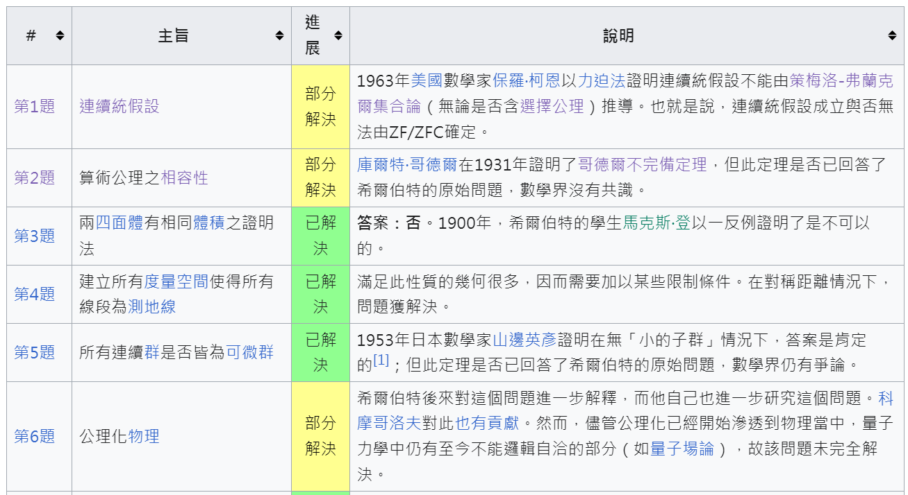

# 1900 年 -- 希爾伯特的問題

1900 年，當時聲望如日中天的希爾伯特 (David Hilbert) ，在巴黎舉行的第二屆國際數學家大會上作了題為《數學問題》的演講，提出了 23 道最重要的數學問題。



其中的第 2 問題《算術公理之相容性》對程式領域產生了重大的影響，但是要了解這個問題，我們得先從《數學領域中的公理系統》開始講起。

## 何謂定理證明

歐洲在文藝復興前期，從穆斯林手上翻譯回了原本失落的《幾何原本》，這本《歐幾里得》的數學著作，成為文藝復興的重要數學典籍。

透過幾何原本，歐洲人發現原來古希臘就有這麼高的數學成就，整個幾何學可以透過《點線面圓》等基本定義，以及一些簡單的公理系統，透過明確的推論法則，一步一步建構出來。

這種透過公理系統建構定理的手法，基本上就是數學家最重要的任務。

問題是，我們能不能將這樣的數學推論給自動化，形式化呢？

這大概就是希爾伯特第 2 問題想要知道的事情了！

要更清楚的說明這個問題，用幾何學描述比較不好說，希爾伯特更想要的是從邏輯學開始的那種描述。

而這種邏輯學的描述，源自於《亞里斯多德》的三段式論。

[亞里斯多德]:https://zh.wikipedia.org/zh-tw/%E4%BA%9A%E9%87%8C%E5%A3%AB%E5%A4%9A%E5%BE%B7
[蘇格拉底]:https://zh.wikipedia.org/zh-tw/%E8%8B%8F%E6%A0%BC%E6%8B%89%E5%BA%95

[亞里斯多德] 曾用 [蘇格拉底] 為例說明三段式論：

1. 大前提：人都會死
2. 小前提：蘇格拉底是人
3. 結論：蘇格拉底會死

但是這樣的邏輯還是有點不精確，也有點複雜，如果我們用現代的 [一階邏輯] 表達，那就可以寫成下列邏輯式

1. ∀x People(x) => Mortal(x)  # Mortal 代表會死的，∀x 代表對於所有的 x。所以這句是說只要 x 是人， x 就會死
2. People(Socrates) 
3. Mortal(Socrates)

[一階邏輯](https://zh.wikipedia.org/zh-tw/%E4%B8%80%E9%98%B6%E9%80%BB%E8%BE%91)

除了 ∀ 代表《對於所有》 之外，還有 ∃ 這個符號代表《存在》，這是一階邏輯的基本符號。

這種一階邏輯，是現代數學企圖將古希臘的邏輯公理化的嘗試。

[布林邏輯]:https://zh.wikipedia.org/zh-tw/%E5%B8%83%E5%B0%94%E4%BB%A3%E6%95%B0

但是一階邏輯還是有點複雜，如果用更簡單的 [布林邏輯] 來示範公理系統與推論法則，那麼會更容易理解。

假如我們有下列事實與規則庫：

    事實： A, B
    規則庫：
        C => G
        A => E
        B => F
        E&F => H

那麼請問我們能推論出 H 嗎？

[肯定前件]:https://zh.wikipedia.org/wiki/%E8%82%AF%E5%AE%9A%E5%89%8D%E4%BB%B6

關於這個問題，我們可以採用 Modus Ponuns ( [肯定前件] ) 推論法則進行

Modus Ponuns 推論法則如下

    P
    P => Q
    -------
    Q

於是我們可以有下列推論

    A
    A => E
    -------
    E

    B
    B => F
    -------
    F

    E&F=>H
    E
    F
    -------
    H

經由《事實+規則庫》，透過  Modus Ponuns 法則，我們可以一步一步推論出 H 是對的。

這就是布林邏輯的一個嚴格推論法範例。

針對這種推論方法，我們寫了一個 Python 的推論引擎範例

```py
def satisfy(exp, facts): # 檢查 facts 是否滿足邏輯式 exp
    vars = exp.split("&")
    for var in vars:
        if not var.strip() in facts:
            return False
    return True

def gen(facts, rules): # 嘗試推論出新的事實
    gen_new = False
    for rule in rules:
        left, right = rule.split("=>")
        if satisfy(left, facts):
            gens = right.split("&")
            for g in gens:
                if not g in facts:
                    print("facts=", facts)
                    facts.add(g)
                    print(f"inference:\n\t{left}\n\t{rule}\n\t-------\n\t{g}\n\n")
                    gen_new = True

    return gen_new

def inference(facts, rules): # 推論引擎
    i=1
    while True:
        print(f"=========gen {i}============")
        if not gen(facts, rules): # 反覆推論，直到失敗為止
            print('沒有新的結果產生 ... ，推論完畢！')
            break
        i = i+1

def load(file):
    facts = set()
    rules = []

    with open(file, "r", encoding="utf-8") as f:
        text = f.read().replace(" ", "")

    for line in text.split("\n"):
        if line.find("=>") != -1:
            rules.append(line)
        elif len(line)>0:
            facts.add(line)
            
    return facts, rules

import sys
facts, rules = load(sys.argv[1]) # 載入知識庫
inference(facts, rules) # 開始推論
```

然後，我們先寫一個簡單的邏輯知識庫 test.kb 當作輸入

檔案: test.kb

```
E&F=>H
A=>E
C=>G
B=>F
A
B
```

用 inference.py 推論執行結果如下

```
$ python inference.py test.kb
=========gen 1============
facts= {'A', 'B'}
inference:
        A
        A=>E
        -------
        E


facts= {'A', 'B', 'E'}
inference:
        B
        B=>F
        -------
        F


=========gen 2============
facts= {'A', 'B', 'E', 'F'}
inference:
        E&F
        E&F=>H
        -------
        H


=========gen 3============
沒有新的結果產生 ... ，推論完畢！
```

這個測試顯示 inference.py 透過知識庫 test.kb 可以經由 A 與 A=>E 推出 E, 由 B 與 B=>F 推論出 F，最後再由 E, F 與 E&F=>H 推論出 H。

接著讓我們引入動物世界的資料庫，對於 《會飛+生蛋+長腿》這樣的事實，推論看看到底會是甚麼動物？

知識庫: animal.kb

```
有毛 => 哺乳類
泌乳 => 哺乳類
有羽毛 => 鳥類 
會飛 & 生蛋 => 鳥類
哺乳類 & 吃肉 => 食肉類
有爪 & 利齒 & 兩眼前視 => 食肉類
哺乳類 & 有蹄 => 有蹄類
哺乳類 & 反芻 => 偶蹄類
哺乳類 & 吃肉 & 斑點 => 獵豹
哺乳類 & 吃肉 & 條紋 => 老虎
有蹄類 & 長腿 & 斑點 => 長頸鹿
有蹄類 & 條紋 => 斑馬
鳥類 & 長腿 => 鴕鳥

會飛
生蛋 
長腿
```

然後再用 inference.py 推論執行結果如下

```
$ python inference.py animal.kb
=========gen 1============
facts= {'生蛋', '會飛', '長腿'}
inference:
        會飛&生蛋
        會飛&生蛋=>鳥類
        -------
        鳥類


facts= {'生蛋', '鳥類', '會飛', '長腿'}
inference:
        鳥類&長腿
        鳥類&長腿=>鴕鳥
        -------
        鴕鳥


=========gen 2============
沒有新的結果產生 ... ，推論完畢！
```

## 邏輯 -- 數學家的程式語言

1972 | [邏輯推論Prolog語言](1972-邏輯推論Prolog語言.md) | 數學家的程式語言

## 希爾伯特想要甚麼？

現在，我們可以清楚的說明希爾伯特的第二問題想要甚麼了 ...

希爾伯特問的是，有沒有可能透過像上述這樣的形式化推論，讓數學定理透過機械化的方式自動被證明出來

而且更重要的是，這樣的機械化方式，是否能證明所有的定理 (完備性)，這大概就是希爾伯特第二問題的想法。

但是、我們上述的推論方法，稱為前向推論方法，基本上就是採用 Modus Ponuns ( [肯定前件] ) 推論法則進行的。


說明：

1. 上述的系統並不能推論出所有的定理，例如我們的系統無法推論出 [笛摩根定律] ，因為我們的系統只會推論出單一的布林變數，而不是邏輯法則。
2. 但是若我們引入一些 [公理] [Axioms] ，搭配 Modus Ponuns ，就有可能推論出像 [笛摩根定律] 這樣的邏輯法則，例如以下的公理系統
    1. $p\to (q\to p)$
    2. $(p\to (q\to r))\to ((p\to q)\to (p\to r))$
    3. $(\neg p\to \neg q)\to (q\to p)$

關於進一步的推論法則，請參考 [Propositional Calculus] ，像是 [Simple axiom system] 或 [Natural deduction system] 。

[Simple axiom system]:https://en.wikipedia.org/wiki/Propositional_calculus#Example_1._Simple_axiom_system
[Natural deduction system]:https://en.wikipedia.org/wiki/Propositional_calculus#Example_2._Natural_deduction_system

[Gödel's completeness theorem]:https://en.wikipedia.org/wiki/G%C3%B6del%27s_completeness_theorem

[Gödel's incompleteness theorems]:https://en.wikipedia.org/wiki/G%C3%B6del%27s_incompleteness_theorems

[Propositional Calculus]:https://en.wikipedia.org/wiki/Propositional_calculus

[笛摩根定律]:https://zh.wikipedia.org/zh-tw/%E5%BE%B7%E6%91%A9%E6%A0%B9%E5%AE%9A%E5%BE%8B

問題是，有沒有甚麼方法可以推論出所有為真的邏輯法則，也就是所有的《定理》呢？

這大概就是希爾伯特想知道的答案了！

[希爾伯特計劃]:https://zh.wikipedia.org/wiki/%E5%B8%8C%E5%B0%94%E4%BC%AF%E7%89%B9%E8%AE%A1%E5%88%92

為了這個想法，希爾伯特除了將其放在 23 個問題中的第二個之外，還於 1920 年提出了 [希爾伯特計劃] (Hilbert Program) ，企圖為為全部的數學提供一個堅實穩固的理論基礎。

具體來說，這個基礎應該包括：

1. 所有數學的形式化。意思是，所有數學應該用一種統一的嚴格形式化的語言，並且按照一套嚴格的規則來使用。
2. 完備性。我們必須證明以下命題：在形式化之後，數學裡所有的真命題都可以被證明（根據上述規則）。
3. 一致性。我們必須證明：運用這一套形式化和它的規則，不可能推導出矛盾。
4. 保守性。我們需要證明：如果某個關於「實際物」的結論用到了「假想物」（如不可數集合）來證明，那麼不用「假想物」的話我們依然可以證明同樣的結論。
5. 確定性。應該有一個算法，來確定每一個形式化的命題是真命題還是假命題。

[希爾伯特綱領]:https://zhuanlan.zhihu.com/p/372622407

而這個計畫的核心理念，也被稱為 [希爾伯特綱領] 。

## 結語

希爾伯特的第 2 問題《算術公理之相容性》，換做電腦的語言，可以想成是否能寫一個程式，自動證明所有算術方面的定理呢？

這個問題，後來被《哥德爾、丘奇、圖靈》等人分別用不同的手法，在不同的領域問過類似的問題，但可惜答案都是否定的。
