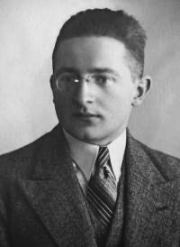

# 1943 年 -- 電腦的發明

[模仿遊戲]:https://zh.wikipedia.org/zh-tw/%E6%A8%A1%E4%BB%BF%E6%B8%B8%E6%88%8F

[圖靈]:https://zh.wikipedia.org/wiki/%E8%89%BE%E4%BC%A6%C2%B7%E5%9B%BE%E7%81%B5

[Enigma]:https://en.wikipedia.org/wiki/Enigma_machine

[Bomba]:https://en.wikipedia.org/wiki/Bomba_(cryptography)

## Enigma 密碼機的破解

在 [模仿遊戲] 這部電影裏，我們看到波蘭數學家試圖破解德軍 Enigma 機器的密碼，然後 [圖靈] 絞盡腦汁要建立一台可以自動破解密碼的 Bomb 機，

但根據我在維基百科上查到的資訊，波蘭數學家 Marian Rejewski 其實已經在 1938 年就創建了 [Bomba] 機。

<!--  -->

但由於德軍已經警覺到 Enigma 可能已經被破解，於是修改了設計。

[布萊切利莊園]:https://zh.wikipedia.org/wiki/%E5%B8%83%E8%90%8A%E5%88%87%E5%88%A9%E5%9C%92

後來波蘭被德軍佔領，於是 Marian Rejewski 逃到了英國，圖靈接手工作，繼續在英國軍方支持的 [布萊切利莊園] 研發出更新版的 [Bombe] 機以破解新型的 [Enigma] 機。

不過這些破解密碼的機器，都是特殊用途的設計，和後來的通用型電腦差異很大。

[ENIAC]:https://zh.wikipedia.org/wiki/%E9%9B%BB%E5%AD%90%E6%95%B8%E5%80%BC%E7%A9%8D%E5%88%86%E8%A8%88%E7%AE%97%E6%A9%9F

## ENIAC 通用電腦

在二次大戰末期，美國開始研發通用型電腦 ENIAC，陸軍資助了 ENIAC 的設計和建造，並在 1943年6月5日 簽訂了合約，以 PX 為代號，在賓夕法尼亞大學穆爾電氣工程學院秘密研發。

1946年2月14日公布後，在賓夕法尼亞大學正式開始使用，總共花了五十萬美元。後來也被陸軍軍械兵團作為軍事用途使用。

ENIAC可以編程，執行複雜的操作序列，可以包含循環、分支和子程序。獲取一個問題並把問題映射到機器上是一個複雜的任務，通常要用幾個星期的時間。當問題在紙上搞清楚之後，通過操作各種開關和電纜把問題「弄進」ENIAC還要用去幾天的時間。然後，還要有一個驗證和測試階段，由機器的「單步執行」能力協助測試。

ENIAC是賓夕法尼亞大學 John Mauchly 和 J. Presper Eckert 構思和設計的。協助開發的設計工程師團隊包括 Robert F. Shaw（函數表）、Jeffrey Chuan Chu（除法器/平方-平方根器）、Thomas Kite Sharpless（主要程序員）、Arthur Burks（乘法器）、Harry Huskey（讀取器/列印器），還有 Jack Davis（累加器）。ENIAC在1987年被評為IEEE里程碑之一。

但其實程式主要是由幾位女性數學家寫的，包含 Jean Jennings, Marlyn Wescoff, Ruth Lichterman, Betty Snyder, Frances Bilas, and Kay McNulty.

雖然 ENIAC 已經是很了不起的成就，但卻有很多缺點，像是《複雜、故障率高、很難將程式輸入、採用十進位運算而非二進位、使用真空管、記憶體很小》等等問題。

不過 ENIAC 並非全世界第一台計算機，以下的電腦比 ENIAC 還早。

1. 德國 Z3 計算機（1941年5月公布）是 Konrad Ernst Otto Zuse 設計的。這是第一台通用的數字計算機。但是它是機電計算機，而不是電子計算機，因為所有功能都使用繼電器。它使用二進位數學進行邏輯地計算。它可用打孔紙帶編程，但是沒有邏輯分支。儘管當初設計的不是圖靈完全的，但是在1998年人們發現它是圖靈完全的（但是如果要利用這種圖靈完全性質，需要複雜、聰明的破解）。1943年，這台計算機在柏林毀於轟炸襲擊。

2. 美國 Atanasoff–Berry 計算機（ABC，1941年夏天公布）是第一台電子計算設備。它使用真空管實現了二進位計算，但是不是通用的，而是僅僅用於求解線性方程組。這台計算機也沒有利用電子計算的速度優勢。有兩方面限制了它的速度：一是旋轉電容鼓存儲器，另一個是它的輸入輸出系統要把中間結果寫出到紙片上。這台計算機是手動控制的，並且不可程式。

3. 英國的巨人計算機（Colossus computer，1943年用於密碼分析）是 Tommy Flowers 設計的。這些計算機是數字的、電子的，可用插板和開關編程，但是僅用於密碼破譯，並不是通用的。

4. Howard Hathaway Aiken 在1944年設計的 Harvard Mark I (馬克一號) 電腦使用繼電器，可用打孔紙帶編程。可以計算一般的數學函數，但是沒有分支結構。

