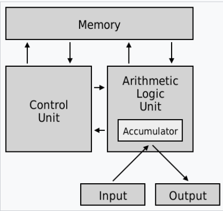

# 1945 年 -- 馮紐曼的報告

## EDVAC 與馮紐曼架構

[馮紐曼]:https://zh.wikipedia.org/wiki/%E7%BA%A6%E7%BF%B0%C2%B7%E5%86%AF%C2%B7%E8%AF%BA%E4%BC%8A%E6%9B%BC

[馮紐曼的報告]:https://zh.wikipedia.org/wiki/EDVAC%E5%A0%B1%E5%91%8A%E6%9B%B8%E7%9A%84%E7%AC%AC%E4%B8%80%E4%BB%BD%E8%8D%89%E6%A1%88

[馮紐曼的報告原稿]:https://ia600208.us.archive.org/32/items/firstdraftofrepo00vonn/firstdraftofrepo00vonn.pdf 

[馮紐曼的報告IEEEAHC]:https://web.mit.edu/STS.035/www/PDFs/edvac.pdf

[冯·诺依曼体系结构：计算机组成的金字塔]:https://zhuanlan.zhihu.com/p/64332433

[馮紐曼] (John von Neumann) 以科學顧問委員的身分參與了 ENIAC 與後來的 EDVAC 計畫，因而知道了 ENIAC 的設計與缺點，以及後來 EDVAC 的一些設計想法。

[馮紐曼] 同時也參加了原子彈的曼哈頓計畫，於是在坐火車通勤到曼哈頓計畫所在地的洛斯阿拉莫斯時，以手寫的方式撰寫了此份報告，並寄回費城給 EDVAC 相關人員。

[馮紐曼架構]:https://zh.wikipedia.org/wiki/%E5%86%AF%C2%B7%E8%AF%BA%E4%BC%8A%E6%9B%BC%E7%BB%93%E6%9E%84

在報告中馮紐曼提出了著名的 [馮紐曼架構] ，這對後來的電腦硬體設計影響深遠，以至於我們都認為這樣的架構應該是理所當然的。



但是、很多看來理所當然的技術，其實是前人嘗試了無數錯誤之後，才發展出來的，舉例而言：

1. 電腦用 2 進位不是理所當然嗎？ 
    * ENIAC 可是用 10 進位的設計喔
2. 負整數用 2 補數表示法不是理所當然嗎？
    * 之前可是有 1 補數和有號數喔
3. 電腦打開就會有畫面，然後有視窗介面不是理所當然嗎？
    * 在全錄 Xerox 的 Alto 電腦之前，視窗介面是不存在的，全都是命令列介面，後來賈伯斯用了 5% Apple 公司股份賣給 Xerox ，只為了換取可以進全錄 PARC 研究中心去看 Alto 這台電腦的技術是怎麼做的
4. 電腦上有個命令列介面不是理所當然嗎？
    * 在大型主機時代，可是有打孔卡電腦，程式必須在打孔卡上刻出來，才可以交給機房人員去放到讀卡機，然後你明天去拿報表看看跑出來的結果有沒有錯(那個年代連螢幕都沒有，輸出是用印表機) 。
5. 電腦可以一邊聽音樂，一邊看影片，然後還一邊打字，這不是理所當然嗎？
    * 如果沒有作業系統，你可是來開機都開不了喔！

所以對於今日的程式人而言，馮紐曼架構看來平凡無奇，但那是因為我們已經每天都在使用馮紐曼架構的電腦，以至於無法想像

> 當初還沒有馮紐曼架構時，電腦設計者到底經歷了甚麼樣可怕的狀況？

## 程式要存在哪裡？

[Stored Program]:https://en.wikipedia.org/wiki/Stored-program_computer

如果沒有馮紐曼架構的 [Stored Program] 概念，程式就不能存在記憶體，因此也就不能寫程式了 (否則、你寫的程式到底要放在哪裡呢？)

如果沒辦法寫程式，那不只沒有 Python / C / Java 等高階語言，也不會有組合語言了。

所以、如果沒有馮紐曼架構，我們將不能用 Python 寫出《邏輯推論、 λ-Calculus、 有限狀態機、圖靈機》等等的模擬程式，也不能輕鬆的透過程式來了解這些觀念了。

我們只能像丘奇那樣，用腦袋去想像那些 α-conversion / β-reduction ，還有 IF/TRUE/FALSE/Y-Combinator 該如何構建出來。

有了 [Stored Program] 的觀念，程式被放在檔案哩，或者放入記憶體中變成一個字串陣列，或者被編譯成執行檔後再放到記憶體裏執行，才能被實現出來。

所以馮紐曼架構非常重要，或許我們可以說，沒有馮紐曼架構，沒有 [Stored Program] 的觀念，就沒有軟體，沒有程式語言 ...

## 組合語言

有了馮紐曼架構，程式或執行檔就可以放進記憶體了

但是、到底要放甚麼形式的程式進記憶體去執行呢？

對電腦最直接的方式，是放二進位的指令進去，讓電腦的 CPU 從記憶體中載入執行

但是要用人腦寫二進位的機器碼，那會是非常痛苦的過程 ...

所以、馮紐曼之後的人們，開始想到要用《文字》來寫程式。

[CODING FOR A.R.C]:https://albert.ias.edu/server/api/core/bitstreams/d47626a1-c739-4445-b0d7-cc3ef692d381/content

[組合語言]:https://en.wikipedia.org/wiki/Assembly_language

1947 年 Kathleen 和 Andrew Donald Booth 開始構思文字來寫類似 [組合語言] 的程式，於是寫了一份 [CODING FOR A.R.C] 的文件。

但是那時候還沒有組譯器，所以將組合語言翻譯成機器碼的動作得用人腦進行。

[The Preparation of Programs for an Electronic Digital Computer]:https://en.wikipedia.org/wiki/The_Preparation_of_Programs_for_an_Electronic_Digital_Computer

1951 年 Wilkes, Wheeler and Gill 在 [The Preparation of Programs for an Electronic Digital Computer] 這本書中提到了 Assembler 這個詞，用來代表如何將多個程式組合在一起的過程。


## 組合語言

雖然在馮紐曼提出 Stored Program 之後，就有了機器語言，然後 1947 年開始發展出組合語言的概念，1951 年出現了組譯器這樣的軟體，但是組合語言對人類來說，還是很不容易寫。

為何不容易寫呢？讓我們來看一個 Linux 上的 x86 組合語言範例：

```asm
        .global main

        .text
main:
        push    %rbx                    # we have to save this since we use it

        mov     $90, %ecx               # ecx will countdown to 0
        xor     %rax, %rax              # rax will hold the current number
        xor     %rbx, %rbx              # rbx will hold the next number
        inc     %rbx                    # rbx is originally 1
print:
        # We need to call printf, but we are using eax, ebx, and ecx.  printf
        # may destroy eax and ecx so we will save these before the call and
        # restore them afterwards.

        push    %rax                    # caller-save register
        push    %rcx                    # caller-save register

        mov     $format, %rdi           # set 1st parameter (format)
        mov     %rax, %rsi              # set 2nd parameter (current_number)
        xor     %rax, %rax              # because printf is varargs

        # Stack is already aligned because we pushed three 8 byte registers
        call    printf                  # printf(format, current_number)

        pop     %rcx                    # restore caller-save register
        pop     %rax                    # restore caller-save register

        mov     %rax, %rdx              # save the current number
        mov     %rbx, %rax              # next number is now current
        add     %rdx, %rbx              # get the new next number
        dec     %ecx                    # count down
        jnz     print                   # if not done counting, do some more

        pop     %rbx                    # restore rbx before returning
        ret
format:
        .asciz  "%20ld\n"
```

在 Linux 上用 gcc 組譯這個程式後執行的結果如下

```
$ gcc -no-pie fib.s -o fib // 巨集版 gcc -no-pie fibMacro.s -o fibMacro
$ ./fib                    //        ./fibMacro
                   0
                   1
                   1
                   2
                   3
                   5
                   8
        ... 中間省略 ...
 1100087778366101931
 1779979416004714189

```

對一般人而言，這根本就是天書，對寫程式的人而言，也會覺得非常難懂。

現代馮紐曼架構的電腦通常有個程式計數器 PC (Program Counter) ，根據 PC 會依序提取指令來執行，除非有 goto / jump 之類的指令才會改變這種執行順序，因此《馮紐曼架構的電腦偏好循序結構》。

所以組合語言指令，通常是一個接一個執行的，除非碰到跳躍指令 (像是上述程式的 jnz print) 才會打破循序結構。

## 結語

ENIAC 電腦的設計是非常艱辛的過程，但是沒有 ENIAC 的話，人們或許也很難創造出更好的電腦。

在創造更新更好電腦的路上，馮紐曼這個數學家踏進來參了一腳，結果卻意外地創造出了《清楚、簡單、又通用》的 [馮紐曼架構] 以及 [Stored Program] 這個觀念。

數學、其實就是把事情想清楚的一種學問 ...

